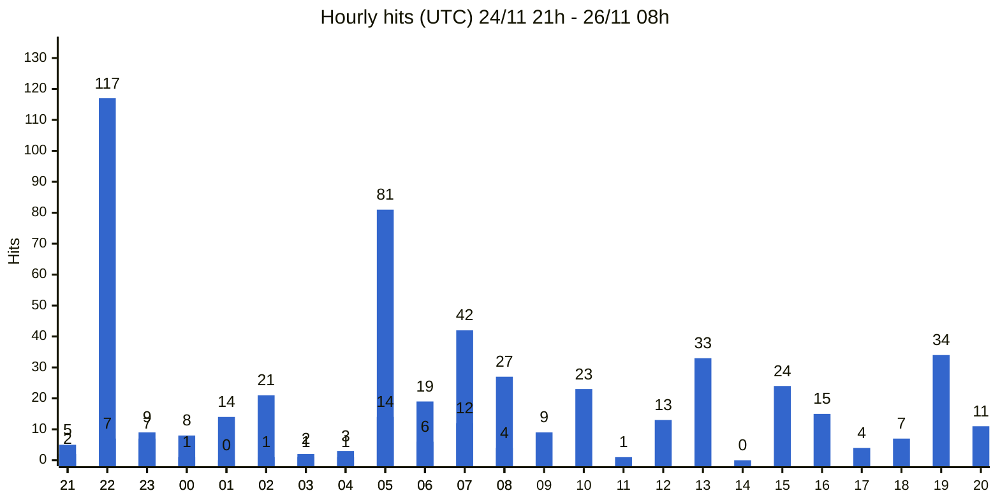
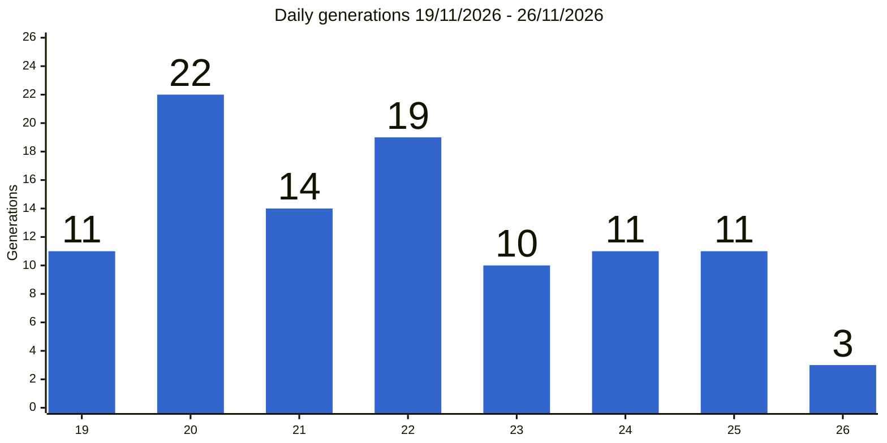
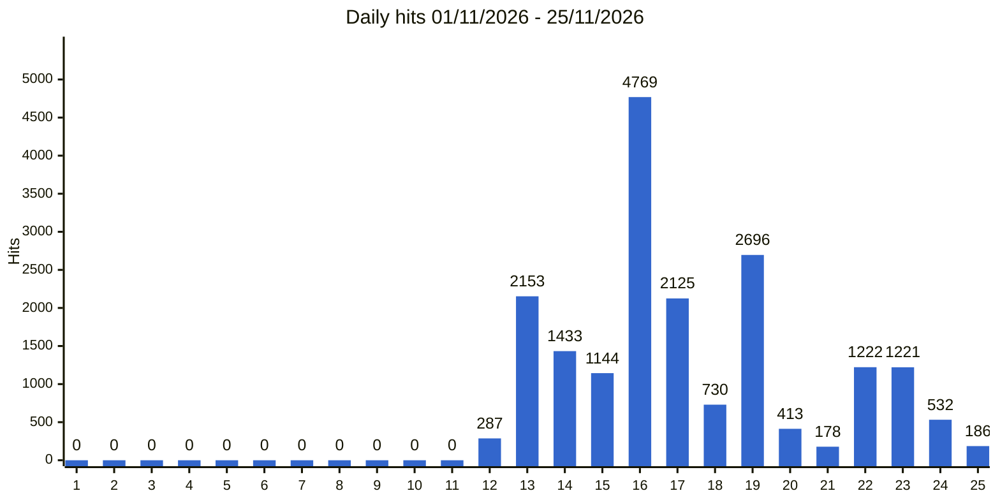

# Usage statistics / Statistiques d'utilisation

Wikipedia2Book on Toolforge, 2026-11-01 → 2026-11-25: **19089** hits.

Source: [Toolviews](https://toolviews.toolforge.org/), updated daily ([toolviews.csv](https://github.com/gmoulard/wikipedia2book/blob/main/docs/toolviews.csv)). Hits are HTTP requests, not people (page, static files, API calls).

Les hits sont des requêtes HTTP, pas des personnes. Mise à jour quotidienne.

## Hourly hits / Hits par heure (UTC, last 36 hours / 36 dernières heures)

Source: Toolforge webservice logs, read every day and just before each deployment, since they are erased at each restart. Every request seen by the application counts, static files included; an hour whose logs were lost before being read shows 0.

Source : journaux du webservice Toolforge, relevés chaque jour et juste avant chaque déploiement. Une heure dont les journaux ont été perdus avant d'être relevés vaut 0. À l'ouverture de la page, les heures plus récentes sont ajoutées en direct depuis l'application.

```mermaid
%%{init: {"xyChart": {"width": 1000, "showDataLabel": true, "showDataLabelOutsideBar": true}, "themeVariables": {"xyChart": {"plotColorPalette": "#3366cc"}}}}%%
xychart-beta
    title "Hourly hits (UTC) 24/11 21h - 26/11 08h"
    x-axis ["21", "22", "23", "00", "01", "02", "03", "04", "05", "06", "07", "08", "09", "10", "11", "12", "13", "14", "15", "16", "17", "18", "19", "20", "21", "22", "23", "00", "01", "02", "03", "04", "05", "06", "07", "08"]
    y-axis "Hits" 0 --> 135
    bar [2, 117, 7, 1, 0, 1, 1, 1, 81, 6, 12, 4, 9, 23, 1, 13, 33, 0, 24, 15, 4, 7, 34, 11, 5, 7, 9, 8, 14, 21, 2, 3, 14, 19, 42, 27]
```

## Daily PDF generations / Générations de PDF par jour (8 days)

Since 2026-11-19: **101** generations, 90 finished, 11 with an error, 0 abandoned. A book in volumes counts one generation per volume.

Depuis le 19/11/2026 : **101** générations, 90 terminées, 11 en erreur, 0 abandonnées. Un livre en volumes compte une génération par volume. Source : journaux du webservice Toolforge, relevés comme les hits par heure.

```mermaid
%%{init: {"xyChart": {"width": 1000, "showDataLabel": true, "showDataLabelOutsideBar": true}, "themeVariables": {"xyChart": {"plotColorPalette": "#3366cc"}}}}%%
xychart-beta
    title "Daily generations 19/11/2026 - 26/11/2026"
    x-axis ["19", "20", "21", "22", "23", "24", "25", "26"]
    y-axis "Generations" 0 --> 26
    bar [11, 22, 14, 19, 10, 11, 11, 3]
```

## Daily hits / Hits par jour (25 days)

```mermaid
%%{init: {"xyChart": {"width": 1000, "showDataLabel": true, "showDataLabelOutsideBar": true}, "themeVariables": {"xyChart": {"plotColorPalette": "#3366cc"}}}}%%
xychart-beta
    title "Daily hits 01/11/2026 - 25/11/2026"
    x-axis ["1", "2", "3", "4", "5", "6", "7", "8", "9", "10", "11", "12", "13", "14", "15", "16", "17", "18", "19", "20", "21", "22", "23", "24", "25"]
    y-axis "Hits" 0 --> 5485
    bar [0, 0, 0, 0, 0, 0, 0, 0, 0, 0, 0, 287, 2153, 1433, 1144, 4769, 2125, 730, 2696, 413, 178, 1222, 1221, 532, 186]
```

## Monthly hits / Hits par mois

```mermaid
%%{init: {"xyChart": {"width": 700, "showDataLabel": true, "showDataLabelOutsideBar": true}, "themeVariables": {"xyChart": {"plotColorPalette": "#3366cc"}}}}%%
xychart-beta
    title "Monthly hits"
    x-axis ["2026-11"]
    y-axis "Hits" 0 --> 21953
    bar [19089]
```
