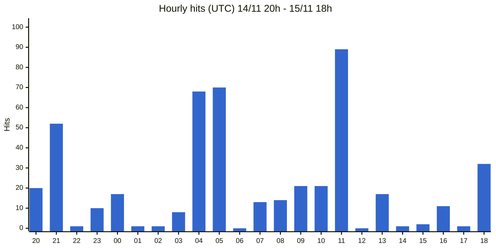
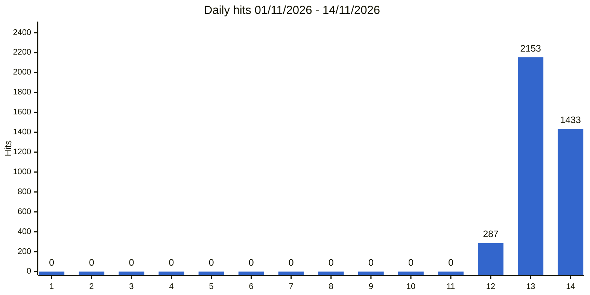
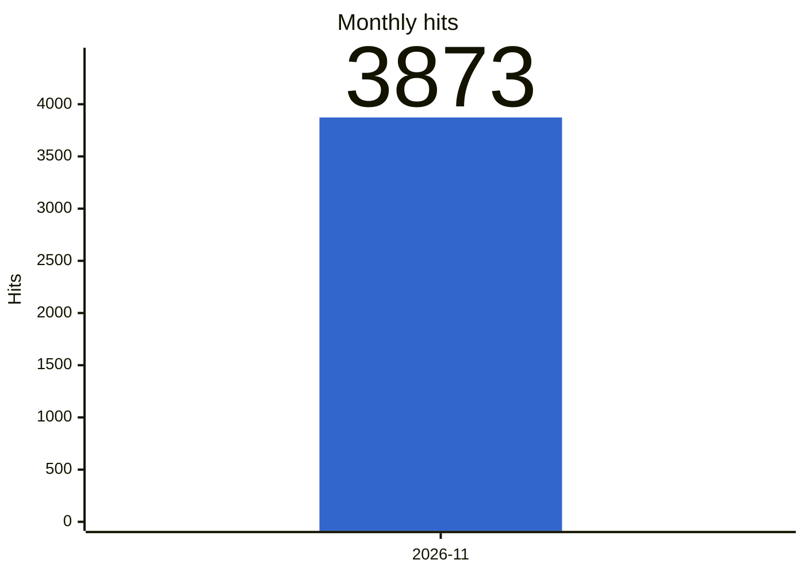

# Usage statistics / Statistiques d'utilisation

Wikipedia2Book on Toolforge, 2026-11-01 → 2026-11-14: **3873** hits.

Source: [Toolviews](https://toolviews.toolforge.org/), updated daily ([toolviews.csv](https://github.com/gmoulard/wikipedia2book/blob/main/docs/toolviews.csv)). Hits are HTTP requests, not people (page, static files, API calls).

Les hits sont des requêtes HTTP, pas des personnes. Mise à jour quotidienne.

## Hourly hits / Hits par heure (UTC, last 36 hours / 36 dernières heures)

Source: Toolforge webservice logs, read every day and just before each deployment, since they are erased at each restart. Every request seen by the application counts, static files included; an hour whose logs were lost before being read shows 0.

Source : journaux du webservice Toolforge, relevés chaque jour et juste avant chaque déploiement. Une heure dont les journaux ont été perdus avant d'être relevés vaut 0. À l'ouverture de la page, les heures plus récentes sont ajoutées en direct depuis l'application.

```mermaid
%%{init: {"xyChart": {"width": 1000, "showDataLabel": true, "showDataLabelOutsideBar": true}, "themeVariables": {"xyChart": {"plotColorPalette": "#3366cc"}}}}%%
xychart-beta
    title "Hourly hits (UTC) 14/11 20h - 15/11 18h"
    x-axis ["20", "21", "22", "23", "00", "01", "02", "03", "04", "05", "06", "07", "08", "09", "10", "11", "12", "13", "14", "15", "16", "17", "18"]
    y-axis "Hits" 0 --> 103
    bar [20, 52, 1, 10, 17, 1, 1, 8, 68, 70, 0, 13, 14, 21, 21, 89, 0, 17, 1, 2, 11, 1, 32]
```

## Daily hits / Hits par jour (14 days)

```mermaid
%%{init: {"xyChart": {"width": 1000, "showDataLabel": true, "showDataLabelOutsideBar": true}, "themeVariables": {"xyChart": {"plotColorPalette": "#3366cc"}}}}%%
xychart-beta
    title "Daily hits 01/11/2026 - 14/11/2026"
    x-axis ["1", "2", "3", "4", "5", "6", "7", "8", "9", "10", "11", "12", "13", "14"]
    y-axis "Hits" 0 --> 2476
    bar [0, 0, 0, 0, 0, 0, 0, 0, 0, 0, 0, 287, 2153, 1433]
```

## Monthly hits / Hits par mois

```mermaid
%%{init: {"xyChart": {"width": 700, "showDataLabel": true, "showDataLabelOutsideBar": true}, "themeVariables": {"xyChart": {"plotColorPalette": "#3366cc"}}}}%%
xychart-beta
    title "Monthly hits"
    x-axis ["2026-11"]
    y-axis "Hits" 0 --> 4454
    bar [3873]
```
